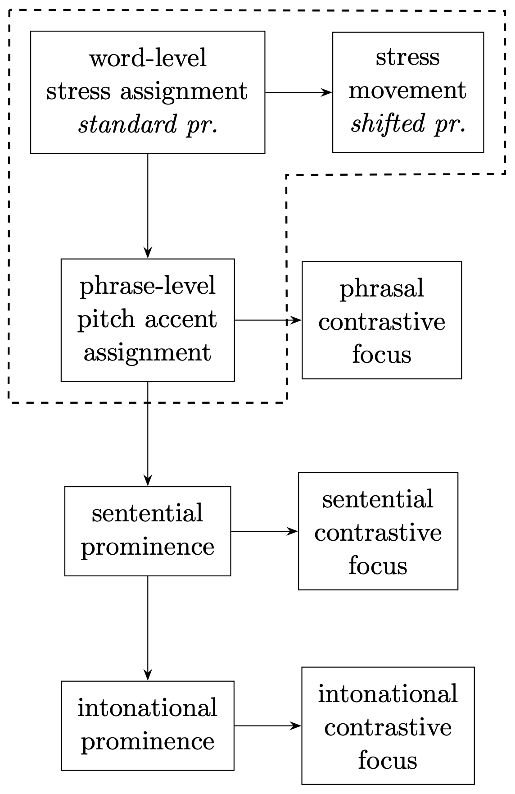

class: middle, center
# NO ONE KNOWS WHERE STRESS FALLS IN KAZAKH

Personal Email Communication (McCollum 2024)

---
#A Well-known Nursery Rhyme in Kazakh

<table style="border-collapse: collapse; width: 100%;">
  <tr>
    <td style="border: none; width: 25%; padding: 8px;"> a.y<strong>ú</strong> </td>
    <td style="border: none; width: 25%; padding: 8px;"> o.t<strong>í</strong>r </td>
    <td style="border: none; width: 25%; padding: 8px;"> p<strong>à:</strong>r.t<strong>á</strong>-da</td>
    <td style="border: none; width: 25%; padding: 8px;"> </td>
  </tr>
  <tr>
    <td style="border: none; width: 25%; padding: 8px;"> cub </td>
    <td style="border: none; width: 25%; padding: 8px;"> sit </td>
    <td style="border: none; width: 25%; padding: 8px;"> desk-LOC </td>
    <td style="border: none; width: 25%; padding: 8px;"> </td>
  </tr>
  <tr>
  <td style="border: none; width: 25%; padding: 8px;"> </td>
  </tr>
  
  <tr>
    <td style="border: none; width: 25%; padding: 8px;"> </td>
    <td style="border: none; width: 25%; padding: 8px;"> e.k<strong>í</strong> </td>
    <td style="border: none; width: 25%; padding: 8px;"> qol-<strong>í</strong> </td>
    <td style="border: none; width: 25%; padding: 8px;"> q<strong>à:</strong>l.t<strong>á</strong>-da </td>
  </tr>
  <tr>
    <td style="border: none; width: 25%; padding: 8px;"> </td>
    <td style="border: none; width: 25%; padding: 8px;"> two </td>
    <td style="border: none; width: 25%; padding: 8px;"> hand-3.Poss </td>
    <td style="border: none; width: 25%; padding: 8px;"> pocket-LOC </td>
  </tr>
  <tr>
  <td style="border: none; width: 25%; padding: 8px;"> </td>
  </tr>
</table>

<table style="border-collapse: collapse; width: 100%;">
  <tr>
    <td style="border: none; width: 25%; padding: 8px;"> <strong>á:</strong> </td>
    <td style="border: none; width: 25%; padding: 8px;"> d<strong>é</strong>-di </td>
    <td style="border: none; width: 25%; padding: 8px;"> <strong>b(ə́):</strong> </td>
    <td style="border: none; width: 25%; padding: 8px;"> d<strong>é</strong>-di </td>
  </tr>
  <tr>
    <td style="border: none; width: 25%; padding: 8px;"> 'A' </td>
    <td style="border: none; width: 25%; padding: 8px;"> say-3.PST </td>
    <td style="border: none; width: 25%; padding: 8px;"> 'B(ə)' </td>
    <td style="border: none; width: 25%; padding: 8px;"> say-3.PST </td>
  </tr>
  <tr>
  <td style="border: none; width: 25%; padding: 8px;"> </td>
  </tr>
  
  <tr>
    <td style="border: none; width: 25%; padding: 8px;"> </td>
    <td style="border: none; width: 25%; padding: 8px;"> 'r'-g<strong>á</strong> </td>
    <td style="border: none; width: 25%; padding: 8px;"> til-<strong>í</strong> </td>
    <td style="border: none; width: 25%; padding: 8px;"> k<strong>è:</strong>l-m<strong>é</strong>-di </td>
  </tr>
  <tr>
    <td style="border: none; width: 25%; padding: 8px;"> </td>
    <td style="border: none; width: 25%; padding: 8px;"> 'r'-DAT </td>
    <td style="border: none; width: 25%; padding: 8px;"> tongue-3.Poss </td>
    <td style="border: none; width: 25%; padding: 8px;"> come-NEG-3.COP </td>
  </tr>
  <tr>
  <td style="border: none; width: 25%; padding: 8px;"> </td>
  </tr>
  <tr>
    <td colspan="4" style="border: none; width:100%; padding: 8px;">'A cub is sitting on the desk, with their hands in the pocket. They pronounced 'A', they pronounced 'B', but they cannot pronounce 'R'.'</td>
  </tr>
</table>

---
#A Well-known Nursery Rhyme in Kazakh

<strong>Melodic Pattern</strong>
$$
\begin{array}{c}
\hline
\\[-1em]
\text{ } \quad \text{ } \quad \text{ } \quad \text{ }\quad \text{◎}\quad \text{ }\quad \text{ } \\
\hline
\\[-1em]
\text{ } \quad \text{○} \quad \text{ } \quad \text{○}\quad \text{ }\quad \text{○}\quad \text{ } \\
\hline
\\[-1em]
\text{●} \quad \text{ } \quad \text{●} \quad \text{ }\quad \text{ }\quad \text{ }\quad \text{●} \\
\hline
\end{array}
$$
 
 
<strong>(Non-) Prominence Types</strong> 
$$
\begin{array}{l}
\text{●: L, one-beat long, low pitch}\\
\text{○: H, one-beat long, high pitch}\\
\text{◎: H+, two-beat long, extra high}
\end{array}
$$

--

---
#A Well-known Nursery Rhyme in Kazakh
 
###If we find two prominence types in a nursery rhyme, could we be inspired, that a language is allowed to exhibit **more than one type of prominence**.

 
 

###Some prior assumptions in this study need phonetic examinations:

1. Word-level prominence is **stress**, and it is realised with a **longer vowel** and a **higher pitch**

2. Phrase-level prominence is **pitch accent**, and it is realised with a **higher pitch**

---
#Grammar Assumed - Sequential Assignment
.pull-left[
- An analysis of *Optimality Theory* is proposed    
- Kazakh is assumed to exhibit **four**-level prominence (word, phrasal, sentential and intonational)    
- The input to **word-level stress assignment** is unparsed syllables    
- The input to the next stage is the output of the previous stage    
- At each level, there is a **default** prominence position (prominent at previous stage, etc.)    
- Deviating from the default position will lead to **contrastive focus** at that level
]
.pull-right[

]
---
#Word-level Stress is NOT limited to the Stem Only

$\boldsymbol{H_0}\qquad\text{Only word stem is qualified to be a phonological word.}$

$\boldsymbol{H_1}\qquad\text{Both word stem and suffixed word are qualified to be phonological words.}$

--

### Prominence on a suffixed word is phrasal, which can be moved to form **contrastive focus**

--
<table style="border-collapse: collapse; width: 100%; height: 120px;">
  <tr style="height: 33%;">
    <td style="border: none; width: 25%; padding: 4px; text-align: left;">(1a)  \(\textit{zhe.k}\color{blue}{\textit{è}}\)</td>
    <td style="border: none; width: 25%; padding: 4px; text-align: left;">'individual' (n.)</td>
    <td style="border: none; width: 25%; padding: 4px; text-align: left;">(stress on final position)</td>
  </tr>
  
  <tr style="height: 33%;">
    <td style="border: none; width: 25%; padding: 4px; text-align: left;">(1b) \(\textit{zhe.ke-l}\color{red}{\textit{í}}\textit{k}\)</td>
    <td style="border: none; width: 25%; padding: 4px; text-align: left;">'individual' (adj.)</td>
    <td style="border: none; width: 25%; padding: 4px; text-align: left;">(suffixation)</td>
  </tr>
  
  <tr style="height: 33%;">
    <td style="border: none; width: 25%; padding: 4px; text-align: left;">(1c) \(\textit{zhe.k}\color{red}{\textit{é}}\textit{-lik}\)</td>
    <td style="border: none; width: 25%; padding: 4px; text-align: left;"></td>
    <td style="border: none; width: 25%; padding: 4px; text-align: left;">(contrastive focus)</td>
  </tr>
</table>

___

--
<table style="border-collapse: collapse; width: 100%; height: 120px;">
  <tr style="height: 33%;">
    <td style="border: none; width: 25%; padding: 4px; text-align: left;">(2a)  \(\textit{h}\color{blue}{\textit{ì}}\textit{.mi.ja}\)</td>
    <td style="border: none; width: 25%; padding: 4px; text-align: left;">'chemistry'</td>
    <td style="border: none; width: 25%; padding: 4px; text-align: left;">(stress kept on position of origin)</td>
  </tr>

  <tr style="height: 33%;">
    <td style="border: none; width: 25%; padding: 4px; text-align: left;">(2b) \(\textit{hi.mi.ja-l}\color{red}{\textit{í}}\textit{q}\)</td>
    <td style="border: none; width: 25%; padding: 4px; text-align: left;">'chemical'</td>
    <td style="border: none; width: 25%; padding: 4px; text-align: left;">(nativised via suffixation)</td>
  </tr>

  <tr style="height: 33%;">
    <td style="border: none; width: 25%; padding: 4px; text-align: left;">(2c)  \(\textit{h}\color{red}{\textit{í}}\textit{.mi.ja}\textit{-l}\color{blue}{\textit{I}}\textit{q}\)</td>
    <td style="border: none; width: 25%; padding: 4px; text-align: left;"></td>
    <td style="border: none; width: 25%; padding: 4px; text-align: left;">(contrastive focus)</td>
  </tr>
</table>

---
#Minimal Parsing vs. Maximal Parsing
.pull-left[
### Minimal Parsing
AllFeetRight >> AllFeetLeft >> Parse-σ
 
 
$$
\sigma\sigma\sigma\sigma\quad\rightarrow\quad\sigma\sigma(\sigma\sigma)
$$
$$
\sigma\sigma\sigma\sigma\sigma\quad\rightarrow\quad\sigma\sigma\sigma(\sigma\sigma)
$$
$$
an.gi.li.ja.liq \quad \rightarrow \quad an.gi.li.(ja.lìq)
$$
]
.pull-right[
### Maximal Parsing
Parse-σ >> AllFeetRight >> AllFeetLeft
 
 
$$
\sigma\sigma\sigma\sigma\quad\rightarrow\quad(\sigma\sigma)(\sigma\sigma)
$$
$$
\sigma\sigma\sigma\sigma\sigma\quad\rightarrow\quad\sigma(\sigma\sigma)(\sigma\sigma)
$$
$$
an.gi.li.ja.liq \quad \rightarrow \quad an.(gi.li).(ja.lìq)
$$
]
 
 
The current study argues for <strong>maximal parsing</strong>, based on analysis of <strong>exceptional</strong> negation marker {<i>-mA</i>}.
 
 
With maximal parsing applied, <strong>*StressToNonHeadFoot</strong> is proposed

<table style="border-collapse: collapse; width: 75%;">
  <tr>
    <td style="border: none; width: 30%; padding: 8px;">*StressToNonHeadFoot</td>
    <td style="border: none; width: 70%; padding: 8px;">assign a violation to every non-head foot that is assigned a secondary stress</td>
  </tr>
</table>

---
# Minimal Parsing Leads to Wrong Predictions Sometimes
### Negation marker {*-mA*} is said to be unstressed in all cases, which is **NOT** true.
(1) 

--
### There is only one foot parsed if **minimal parsing** is applied.
(3) 

---
# Minimal Parsing Leads to Wrong Predictions Sometimes
### Negation marker {*-mA*} is said to be unstressed in all cases, which is **NOT** true.
(1) 
(2) 

### There is only one foot parsed if **minimal parsing** is applied.
(3) 

---
# Maximal Parsing
### Minimal parsing does not solve cases **with** or **without** an intonational marker.

### The case without an intonational marker will be solved via syntactic tools in the current study.

### There is a **default** position at each level, but an **overt marker** such as the intonational marker {*xi*} is able to re-adjust the position of prominence.

---
# Maximal Parsing
### Minimal parsing does not solve cases **with** or **without** an intonational marker.

<table style="border-collapse: collapse; width: 75%;">
  <tr>
    <td style="border: none; width: 30%; padding: 8px;">AlignToHeadMarker</td>
    <td style="border: none; width: 70%; padding: 8px;">assign a violation to every head foot whose right edge is not aligned to the left edge of the head marker</td>
  </tr>
  <tr>
    <td style="border: none; width: 30%; padding: 8px;">FaithHeadFoot</td>
    <td style="border: none; width: 70%; padding: 8px;">assign a violation to every head foot in the output that is not a head foot in the input</td>
  </tr>
</table>

---
#Word-level Stress

### 1. Syllables are maximally parsed (<strong>Parse-σ >> AllFeetRight >> AllFeetLeft</strong>) and they are parsed into disyllabic feet only (<strong>FootBinary</strong>). 

---
#Word-level Stress

### 2. The default word-level stress (primary) goes to the **final** syllable of a word (<strong>MainRight >> MainLeft</strong>), and there is only one primary stress (<strong>Culminativity</strong>).

--
### 3. No secondary stress is allowed (<strong>*StressToNonHeadFoot</strong>), even though feet are parsed.

--
### 4. The stress is aligned to the right edge of a foot (<strong>Iambic</strong>).

--

---
#Word-level Stress

### 5. The stress is assigned to a heavy syllable without exceptions (<strong>StressToWeight</strong>).

--
### 6. The stress is assigned to the **morphological head** (M-head) of the phonological word (<strong>MainToM-Head</strong>).

--

---
#Word-level Stress

### 5. The stress is assigned to a heavy syllable without exceptions (<strong>StressToWeight</strong>).

### 6. The stress is assigned to the **morphological head** (M-head) of the phonological word (<strong>MainToM-Head</strong>).

---
#Phrase-level Pitch Accent

###The **input** to the phrasal level is the **output** of prominence assigned at the word level.

###Phrasal pitch accent goes to the position that is already prominent in the **input** (where the word stress goes, <strong>FaithHeadFoot >> ProminenceToP-HeadFoot</strong>).
<table style="border-collapse: collapse; width: 75%;">
  <tr>
    <td style="border: none; width: 40%; padding: 8px;">FaithHeadFoot</td>
    <td style="border: none; width: 60%; padding: 8px;">assign a violation to every head foot in the output that is not a head foot in the input</td>
  </tr>
  <tr>
    <td style="border: none; width: 40%; padding: 8px;">ProminenceToP-HeadFoot</td>
    <td style="border: none; width: 60%; padding: 8px;">assign a violation to every prominent that is not assigned to the phonological head foot</td>
  </tr>
</table>

---
#Phrase-level Pitch Accent

###The **input** to the phrasal level is the **output** of prominence assigned at the word level.

###Syllbles are parsed in the **input**, there is no de-parsing and re-parsing process by default (<strong>FaithFeetStructure</strong>).

<table style="border-collapse: collapse; width: 75%;">
  <tr>
    <td style="border: none; width: 30%; padding: 8px;">FaithFeetStructure</td>
    <td style="border: none; width: 70%; padding: 8px;">assign a violation to feet structure mismatch between the input and the output</td>
  </tr>
</table>
 

--

---
#Interim Summary

### There are **four** levels of prominence in Kazakh and there is a **default** position where the prominence at that level goes to.

--
### The prominence deviating from the **default** position forms **contrastive focus** at that level.

<table style="border-collapse: collapse; width: 92%;">
  <tr>
    <td style="border: none; width: 25%; padding: 8px;"><strong>word level</strong></td>
    <td style="border: none; width: 30%; padding: 8px;"><i>shifted</i> pronunciation</td>
    <td style="border: none; width: 45%; padding: 8px;">poetry, nursery rhyme</td>
  </tr>
  <tr>
    <td style="border: none; width: 25%; padding: 8px;"><strong>phrase level</strong></td>
    <td style="border: none; width: 30%; padding: 8px;">contrastive focus</td>
    <td style="border: none; width: 45%; padding: 8px;">morphemes in contrast</td>
  </tr>
  <tr>
    <td style="border: none; width: 25%; padding: 8px;"><strong>sentential level</strong></td>
    <td style="border: none; width: 30%; padding: 8px;">focus</td>
    <td style="border: none; width: 45%; padding: 8px;">syntactic constituent in contrast</td>
  </tr>
  <tr>
    <td style="border: none; width: 25%; padding: 8px;"><strong>intonational level</strong></td>
    <td style="border: none; width: 30%; padding: 8px;">semantic contrast</td>
    <td style="border: none; width: 45%; padding: 8px;">tune changing</td>
  </tr>
</table>

--

### An overt marker might be able to re-adjust the prominence (the intonational marker ***xi***, etc.)

---
#Exceptions
### Some suffixes do not bear prominence: **Person Agreement** (a), **Progressive** Verbs (b), **Copulas** (c) and the lower **Negation** marker (d).

--

### Sequential prominence assignment requires that they are unstressed at the word-level.

--

### They do not share any commonality in terms of **Phonology**.

---
#Exceptions
### Some suffixes do not bear prominence: **Person Agreement** (a), **Progressive** Verbs (b), **Copulas** (c) and the lower **Negation** marker (d).

### YET, (a)-(c) are **syntactically** similar, all of them are higher than the **tense phrase** (TP)

 $\quad$
 $\quad$

---
#Exceptions
### Some suffixes do not bear prominence: **Person Agreement** (a), **Progressive** Verbs (b), **Copulas** (c) and the lower **Negation** marker (d).

### The lower *Negation* marker is assumed to be higher than **TP** as well. It is lowered to merged with the **aspect** (Asp) and loses its *head-ness*.

---
#Exceptions
### Since the negation marker has lost its **head-ness** during the lowering, it cannot bear the prominence (**phonological inability incurred by morphology**).

### Anything below **TP** is sent to **PF** for prominence assignment!
---
#Conclusion

### 1. Unification**!**

### 2. Maximal Parsing**!**

### 3. Morphology and Syntax interacts with Phonology**!**

### 4. Heads are not necessarily defined solely by Phonology**!**

### 5. Tense Phrase as a Stress-Assigning Phase**!**

 

### **I TRIED EVERYTHING I CAN!**

  

---
class: center, middle

# Thank You for Listening!

## Тыңдағандарыңызға көп рахмет!
### Мерлин Балқащ Қасенов Удиновский

Slides created via the R package [**Xaringan**](https://github.com/yihui/xaringan).
